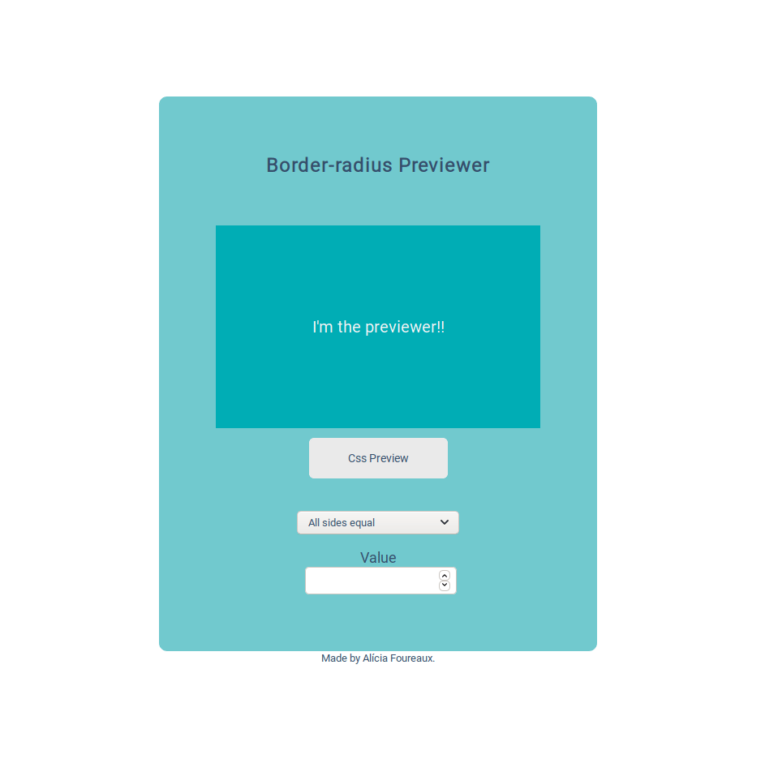

<h2 align="center">🎨 Border-radius Previewer</h2>

Preview how CSS3 border-radius values affect an element.

<h4 align="center">Deploy -> https://challenge2-borderradiuspreviewer.netlify.app/</h4>

## 💡What is it?
Border-radius Previewer is OneProjectOneWeek's second challenge. It allows you to preview how css border-radius values affect an element by changing the values and then allows you to copy the final value to the clipboard and use it.

## ❓How to use?
Select how many sides you want to affect, if you want all of them or other options. In the inputs enter the value you want. Then click on the css preview element to copy it.

## 🚧Built With
- JavaScript
- Html
