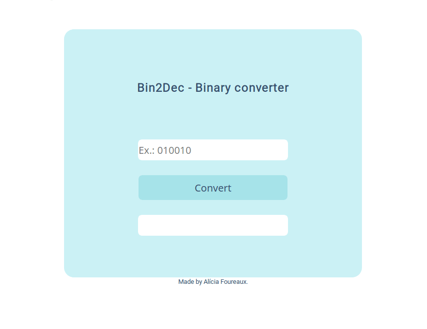

<h2 align="center">👩‍💻 Bin2Dec</h2>

Binary to decimal converter.

<h4 align="center">Deploy -> https://challenge1-bin2dec.netlify.app/</h4>

## 💡What is it?
Bin2Dec is OneProjectOneWeek's first challenge. It allows you to convert a binary number to a decimal number.

## ❓How to use?
In the first input you enter the binary number to convert, click the `Convert` button to convert, then the converted decimal number will appear in the second input.

## 🚧Built With
- JavaScript
- Html
