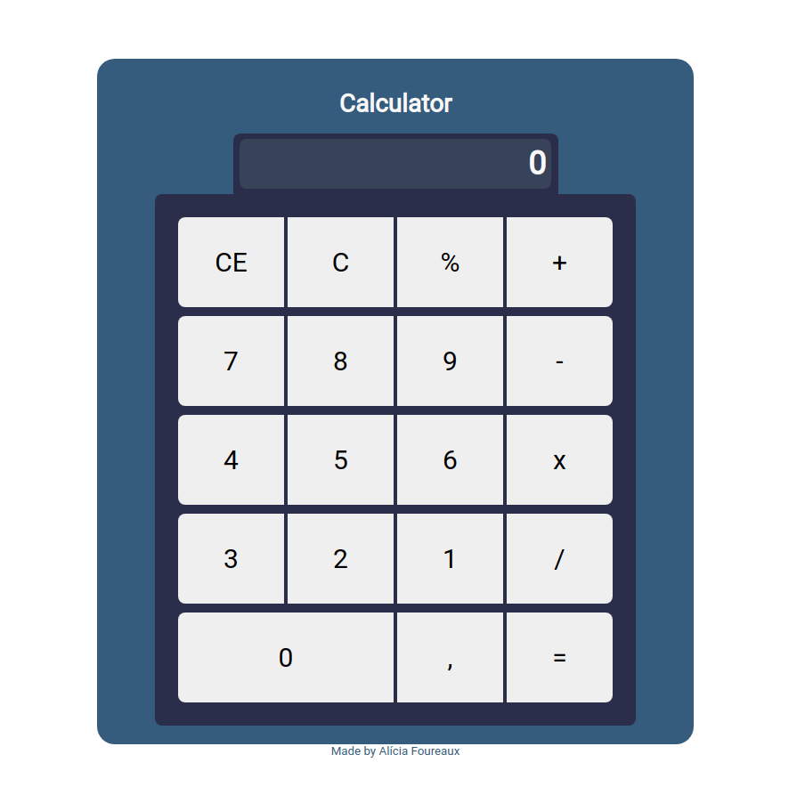

<h2 align="center">🖩 Calculator</h2>

A simple calculator.

<h4 align="center">Deploy -> https://challenge3-calculator.netlify.app/</h4>

<h1 align="center">
    
</h1>

## 💡What is it?
Calculator is OneProjectOneWeek's third challenge. It allows you to calculate the amount resulting from a specific account that you enter. It does just about everything a normal calculator does.

## ❓How to use?
Enter a value through the pad and use the operators to calculate. You can use the CE to delete a value you have just entered or else C to delete the entire history.

## 🚧Built With
- JavaScript
- Html
